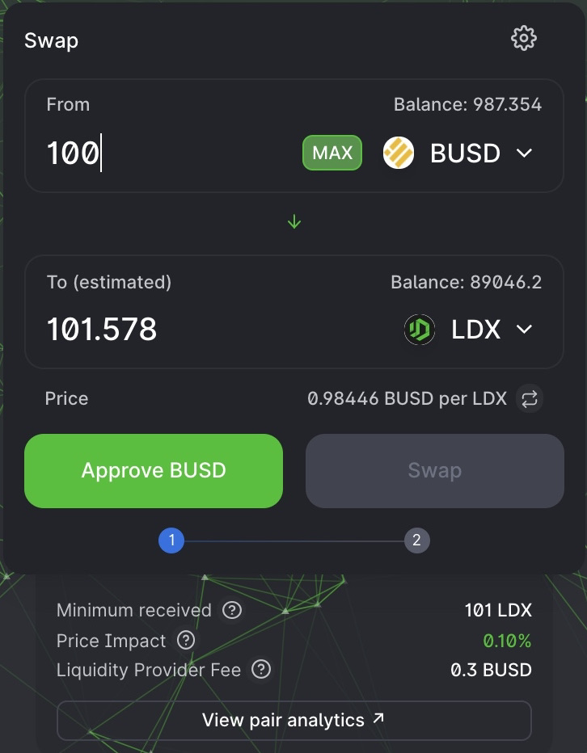
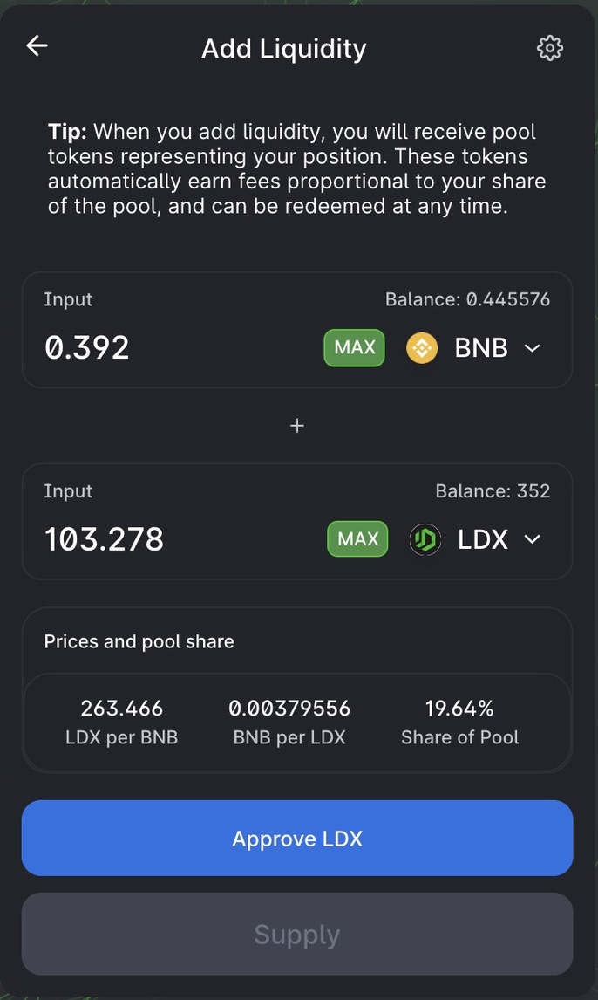
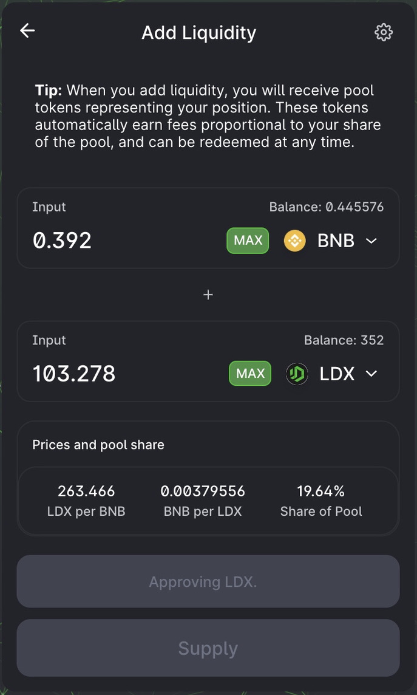

# Approval Introduction

**Approval** process is a procedure in transactions, where the protocol asks the user for approval regarding the use of Wallet balances. The procedure runs when the user wants to transact via the LITEDEX protocol. And this procedure only runs during the first time when the user makes a transaction. In LITEDEX itself, this procedure has been implemented in every feature provided. Here's what the approval looks like:‌

1. **Swap**

2. **Liquidity Pool**‌

3. **Staking**‌

4. **Yield Farming‌**

All approval procedures are carried out through Smart Contracts, which means its in high security. Therefore, LITEDEX ensure that every transaction is really secure.

