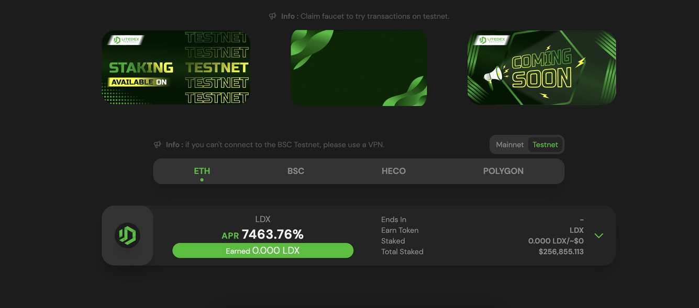

# How to Add LDX Token

Before adding LDX Token, make sure you have it installed and connected to your wallet. If you haven't installed it, we provide an explanation and steps [here](how-to-make-a-wallet.md).

1. Visit [app.litedex.io/staking](https://app.litedex.io/staking) website page

2. Click on the LDX stake line

and details appear

3. Click "Add to Metamask"

4. Confirm on your Metamask Wallet

5. Done, LDX token is in your Metamask Wallet

