# How to make a Wallet

Wallet is available on smartphones and desktop computers/web browsers (Android/IOS). You must use the Wallet as needed. For traders who often use the smartphones, you can install it on your smartphone. And for traders who often using desktop, you can use the Wallet on your desktop computer or web browser.

You can find Wallet information, and how to install it below.




**Metamask** is a popular browser extension and as a cryptocurrency Wallet connected to the Ethereum blockchain. Metamask supports Decentralized Applications (DApps) and one of the best Ethereum Wallet solutions compatible with multiple browsers such as Chrome, Firefox, Brave, and Microsoft Edge.

**Guide to creating a Wallet on Metamask**

* Smartphone (Guide not available)
* Desktop/Web Browser

How to create a Metamask Wallet

1\. Visit the page [https://metamask.io/download](https://metamask.io/download)

2\. After visiting the website, the screen will appear as shown below.

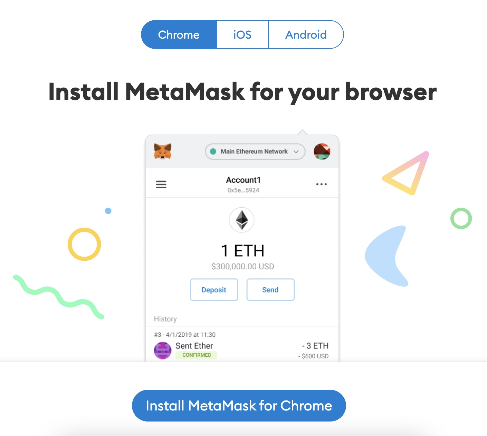

In this tutorial, we will provide how to install in Browser (Chrome). Click "Install Metamask for Chrome".

3\. Wait for the process, until a new tab appears with a display shown as below.

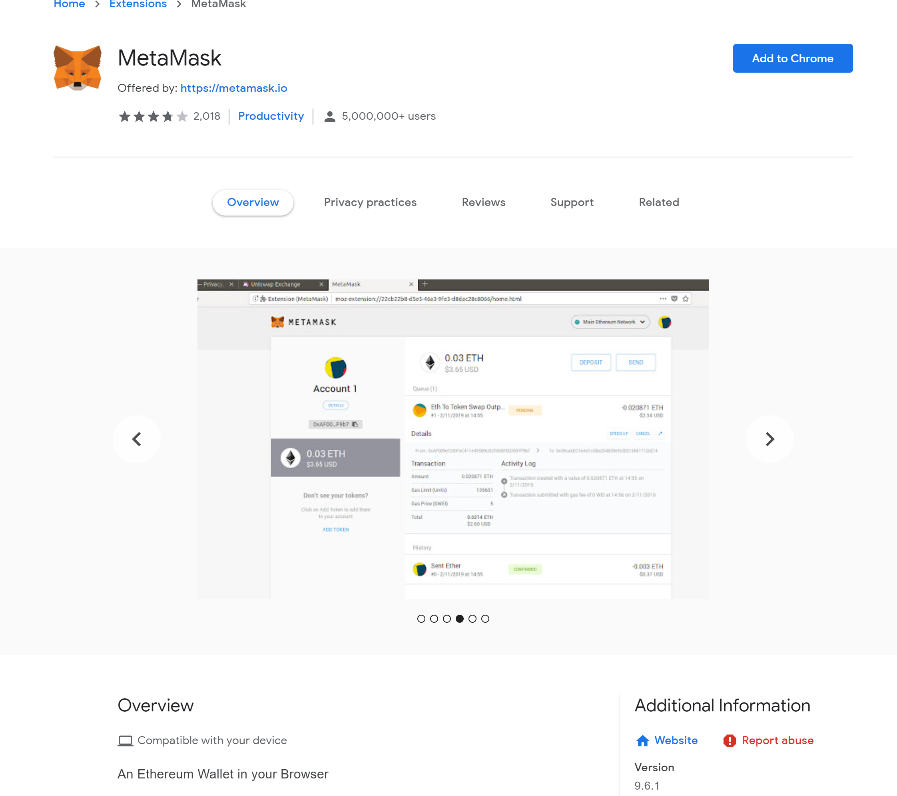

You can Click "Add to Chrome", then there will be a notification.

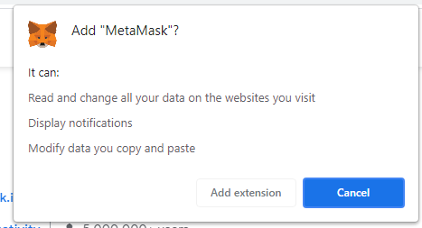

Click "Add extension" and wait for the extension download process to complete.

4\. The new tab displays this.

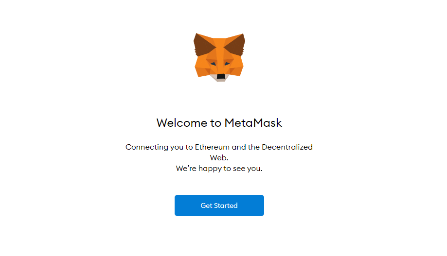

You Click "Get Started" to continue.

5\. If you already have a Metamask Wallet, you can click "Import Wallet" to import the private you previously had. But in this tutorial, we will only create a Metamask Wallet.

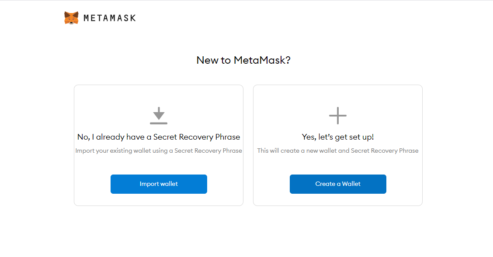

You can continue creating by clicking "Create a Wallet".

6\. Metamask informs to help improve Metamask by collecting usage data.

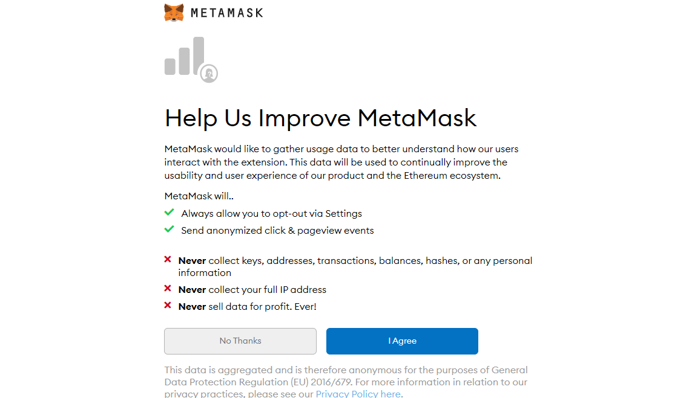

If you want to help Metamask, you can click "I Agree". But In this tutorial, We will click "No Thanks".

7\. The next process is to create a password.

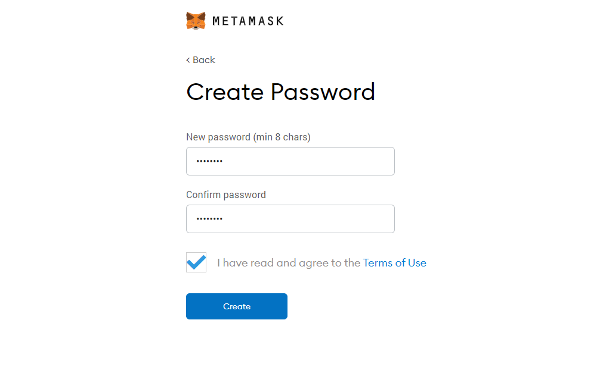

We recommend to use a unique password. After you have entered the password, click the "I have read and agree to the Terms of Use" checkbox and click "Create".

8\. For security reasons, Metamask provides short videos to learn your recovery phrases, and how to keep your Wallet safe. We highly recommend watching it as to understand it well.

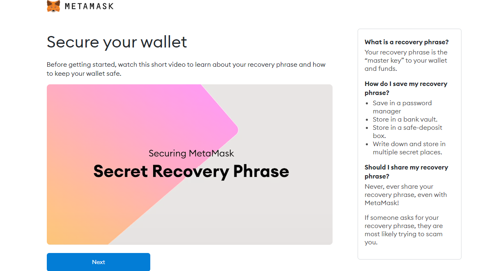

If you have understood well, you can click "Next".

9\. You can view the phrase by clicking "CLICK HERE TO REVEAL SECRET WORDS" and you write the displayed phrase. After that click "Next".

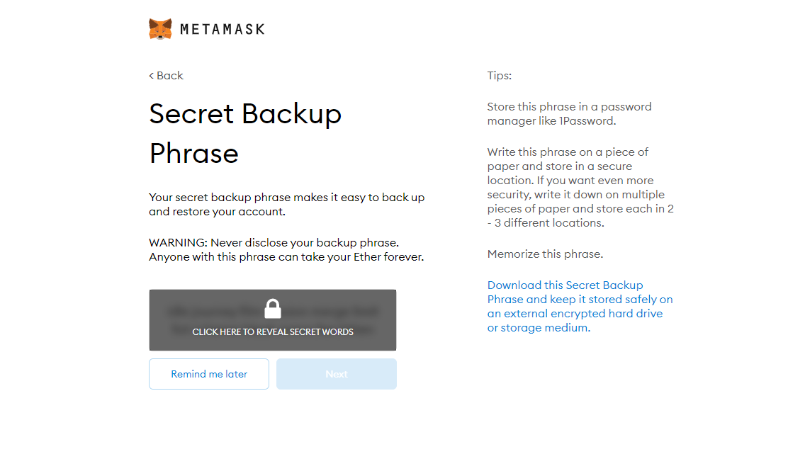

10\. Confirm the phrase in the order and you have them by clicking word by word. And if it has been confirmed correctly, you can click "Confirm".

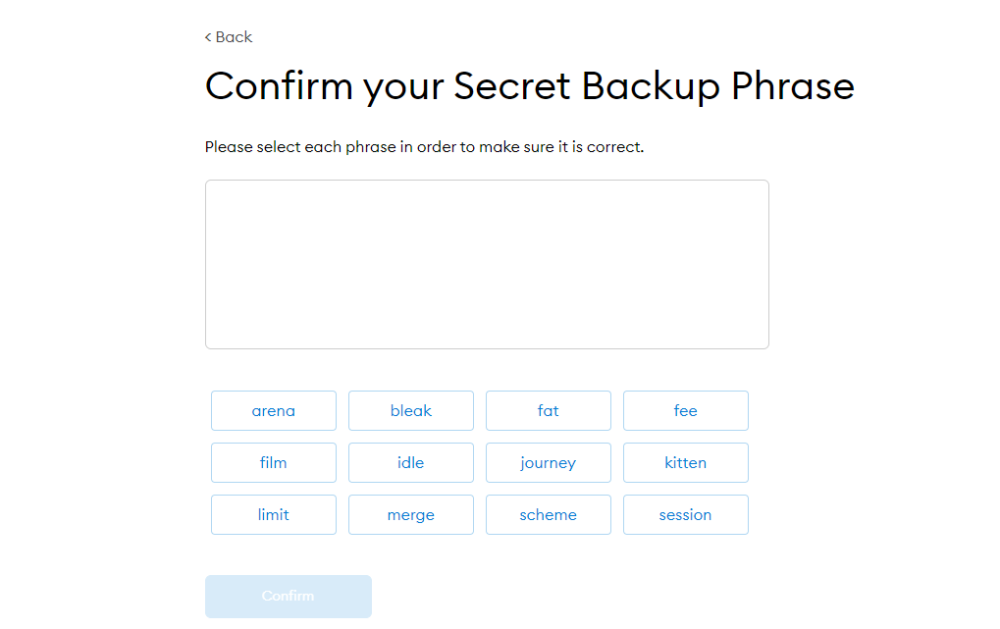

11\. Congratulations you have created a Metamask Wallet. You can click "All Done" to see the Metamask Wallet that has been created.

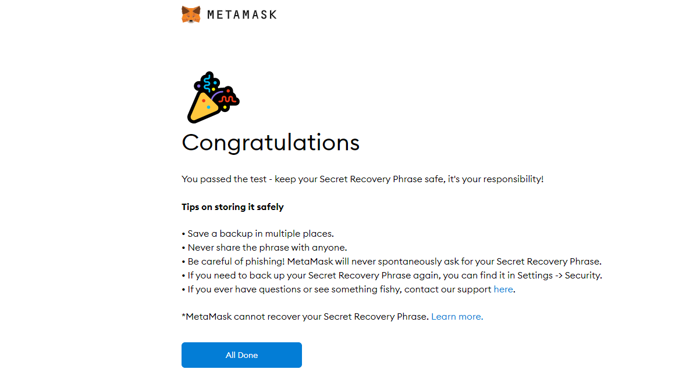

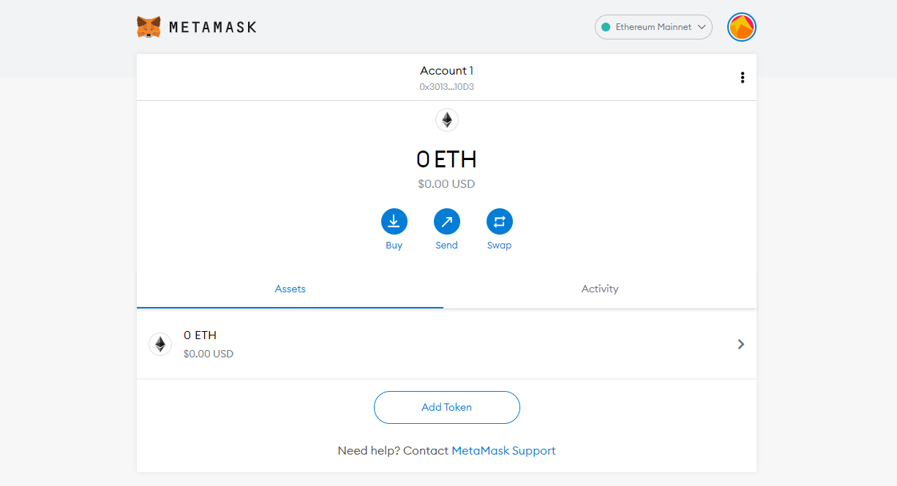

If you want to know more about Metamask, you can visit the Official Website [here](https://metamask.io/).




**MathWallet** is a multi-platform (mobile/desktop/extension/hardware) universal crypto Wallet that allows storing BTC, ETH, BNB and other Coins in one Wallet.

**Guide to creat a Wallet in MathWallet**

* Smartphone (Guide not available)
* Desktop/Web Browser (Visit the guide [here](https://mathwallet.medium.com/tutorial-of-math-wallet-browser-extension-d9338f1a6f7))

If you want to know more about MathWallet, you can visit the official website, as well as download and install it [here](https://mathwallet.org/).[\
](https://app.gitbook.com/@litedex-1/s/litedex-documentation/get-started/wallet-introduction)




**SafePal** is dedicated to provide a secure and user-friendly crypto management platform for the mass users to secure and grow their crypto assets safely and conveniently. This is the first hardware Wallet that Binance has invested in and supported.

**Guide to creating a Wallet in SafePal**

* Smartphone (Visit the guide [here](https://docs.safepal.io/safepal-app/how-to-create-a-safepal-software-wallet))

If you want to know more about SafePal, you can visit the Official Website [here](https://www.safepal.io/about). If you want to download and install, you can visit [safepal.io](https://www.safepal.io/download).




**TrustWallet** is a Decentralized Wallet that aims to make crypto more accessible and the key to ownership for cryptocurrencies. It also has access to DApps, and does not store any personal information.

**Guide to creating a Wallet on TrustWallet**

* Smartphone (Visit the guide [here](https://community.trustwallet.com/t/how-to-create-a-multi-coin-wallet/41))

If you want to know more about TrustWallet, you can visit the official website, as well as download and install it [here](https://trustwallet.com/).




**HuobiWallet** has a goal and vision to optimize financial services, free global wealth, and protect user privacy. HuobiWallet is a professional Multi-chain lightweight Wallet that ensures the security of users' assets and provides a simple, convenient and secure Digital Asset Management (DAM) service.

**Guide to creating a Wallet on HuobiWallet**

* Smartphone (Visit the guide [here](https://support.huobiwallet.com/hc/en-us/articles/360000135181-How-Can-I-Create-a-Wallet-))

If you want to know more about HuobiWallet, you can visit the Official Website here. If you want to download and install, you can visit [huobiwallet.com](https://www.huobiwallet.com/).



****

**TokenPocket** is an easy-to-use Multi-chain Wallet, supports all leading crypto/chain currencies (Bitcoin, Ethereum, EOS, Polkadot, TRON, BSC, Heco, IOST, Cosmos, Binance, BOS, MOAC, and Jingtum) and supports more than 2200 DApps. The private key is stored on your device and protected with multiple layers of encryption.

**Guide to making a Wallet in TokenPocket**

* Smartphone (Guide not available)

If you want to know more about TokenPocket, you can visit the official website, as well as download and install it [here](https://www.tokenpocket.pro/).


