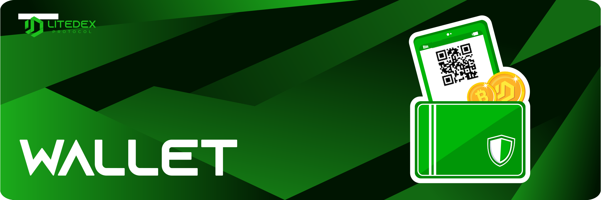

# Wallet Introduction

**Wallet** is the main feature which is use to store, send and receive various cryptocurrency tokens on the Blockchain network. LITEDEX had supported the well-known cryptocurrency wallets provided in the list.‌

**Available wallets**:‌

* Metamask
* Safepal
* TrustWallet
* TokenPocket
* HuobiWallet
* MathWallet
* And wallets supported by WalletConnect

