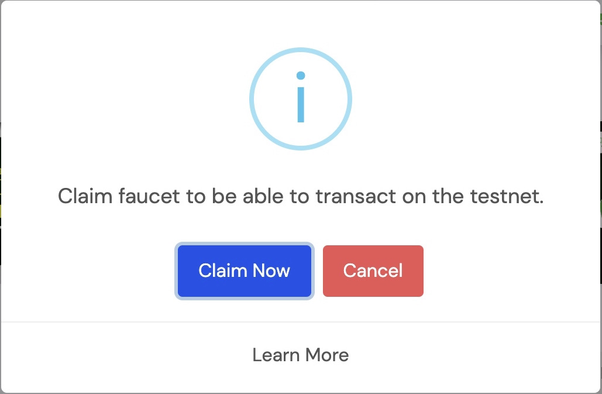
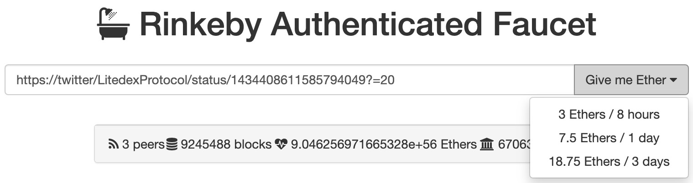
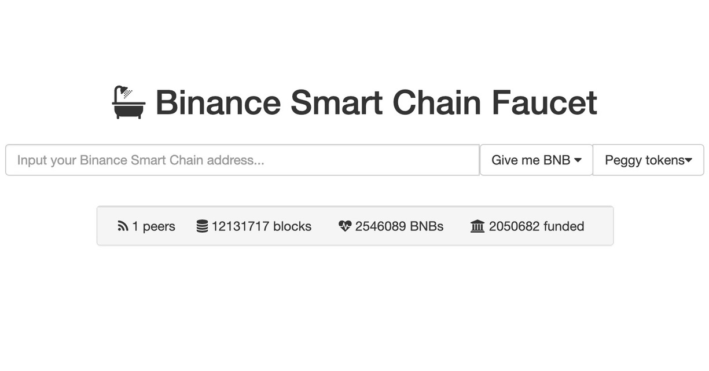
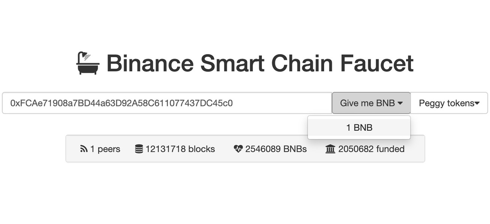

# How to Claim Faucet

### ETH Faucet Claim \(Rinkeby\)

**Preparation**

Before making claims faucet, you should install metamask wallet and make sure the network is in the ETH testnet \(Rinkeby\) and has a twitter account.

**Starting a ETH faucet claim**

1. Visit [app.litedex.io](https://app.litedex.io) page

2. Click the "Claim Faucet" button

3. The website displays a pop-up and click on "Claim Now"

4. A new tab appears and displays the Rinkeby faucet page.

5. Copy your Wallet address and paste it into your twitter account.

6. Copy the URL of the tweet and paste it into the input of the Rinkeby faucet website page, click the "Give me Ether" button, select the amount of ether you want.

7. Check balances in your metamask

**Watch the video below :**



### BSC Faucet Claim

**Preparation**

Before making a faucet claim, you have to install the metamask wallet and make sure the network is in the BSC.

**Starting a BSC faucet claim**

1. Visit [app.litedex.io](https://app.litedex.io/) page

2. Click the “Claim Faucet” button

3. The website displays a pop up and click “Claim Now”

4. A new tab appears showing faucet input

5. Copy your Wallet address, paste it into the faucet input and click the “Give me BNB” button.

6. Wait for the BNB coin delivery process to your address

7. And check your wallet balance

**Watch the video below :**



