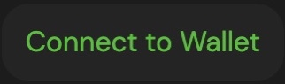

# Network Switch

### ETH Network

Before moving the mainnet network to testnet, make sure you have installed the metamask wallet. If you haven't installed it yet, we have provided tutorials and explanations [here](../get-started/how-to-make-a-wallet.md).

1. Visit the [app.litedex.io](https://app.litedex.io) website page

2. Click the "Connect to Wallet" button at the top right.

3. The website shows a pop up containing a list of wallets, click "metamask" Wallets.

4. Wait a few moments until the top right button displays your address.

5. Pay attention to the position of the button on the ETH testnet network, if you haven't switched networks, follow the steps below.

**GIF ETH**

### BSC Network

Before moving the mainnet network to testnet, make sure you have installed the metamask wallet. If you haven't installed it yet, we have provided tutorials and explanations [here](../get-started/how-to-make-a-wallet.md).

1. Visit the [app.litedex.io](https://app.litedex.io) website page

2. Click the "Connect to Wallet" button at the top right.

3. The website shows a pop up containing a list of wallets, click "metamask" Wallets.

4. Wait a few moments until the top right button displays your address.

5. Pay attention to the position of the button on the BSC testnet network, if you haven't switched networks, follow the steps below.

**GIF BSC**

