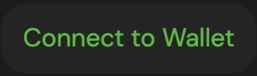
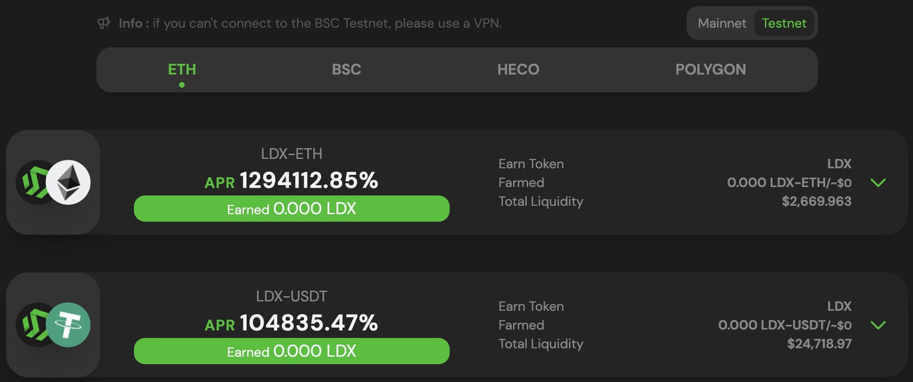
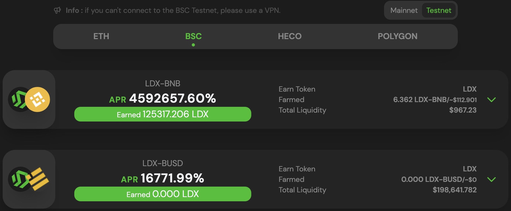

# Switch Network

### ETH Network

Before moving the mainnet network to testnet, make sure you have installed the metamask wallet. If you haven't installed it yet, we have provided tutorials and explanations [here](../get-started/how-to-make-a-wallet.md).

1. Visit the [app.litedex.io](https://app.litedex.io) website page

2. Click the "Connect to Wallet" button at the top right.

3. The website shows a pop up containing a list of wallets, click "metamask" Wallets.

4. Wait a few moments until the top right button displays your address.

5. Pay attention to this button, if your position is on the mainnet, click the testnet button.

6. And click the ETH button.

7. ETH network switching was successful.

**Watch the video below :**



### BSC Network

Before moving the mainnet network to testnet, make sure you have installed the metamask wallet. If you haven't installed it yet, we have provided tutorials and explanations [here](../get-started/how-to-make-a-wallet.md).

1. Visit the [app.litedex.io](https://app.litedex.io) website page

2. Click the "Connect to Wallet" button at the top right.

3. The website shows a pop up containing a list of wallets, click "metamask" Wallets.

4. Wait a few moments until the top right button displays your address.

5. Pay attention to this button, if your position is on the mainnet, click the testnet button.

6. And click the BSC button.

7. BSC network switching was successful.

