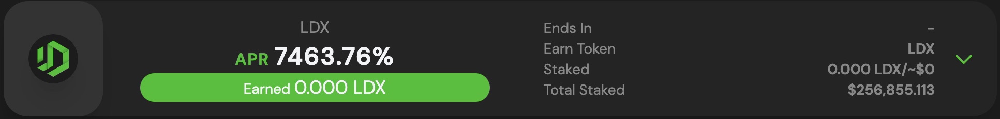

# Cara Menambahkan Token LDX

Sebelum menambahkan Token LDX, pastikan Anda telah menginstal dan sambungkan dengan wallet Anda. Jika Anda belum menginstallnya, kami memberikan penjelasan dan langkah-langkahnya [disini](cara-membuat-wallet.md).

1. Kunjungi halaman website [app.litedex.io/staking](http://app.litedex.io/staking)

2. Klik baris stake LDX

dan muncul detail 

3. Klik “Add to Metamask”

4. Konfirmasikan pada wallet metamask Anda

5. Selesai, token LDX ada di Wallet metamask Anda

