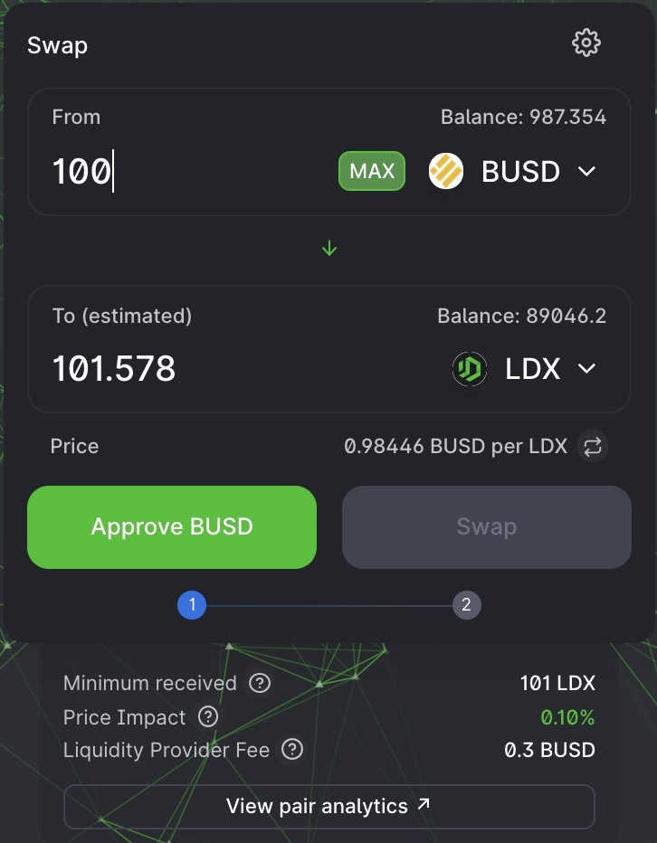
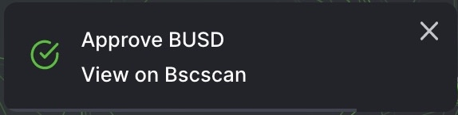
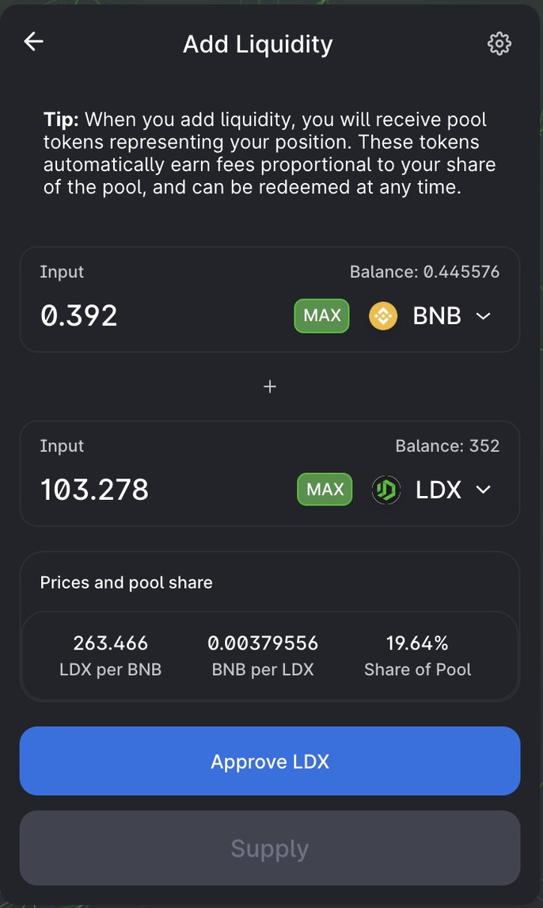
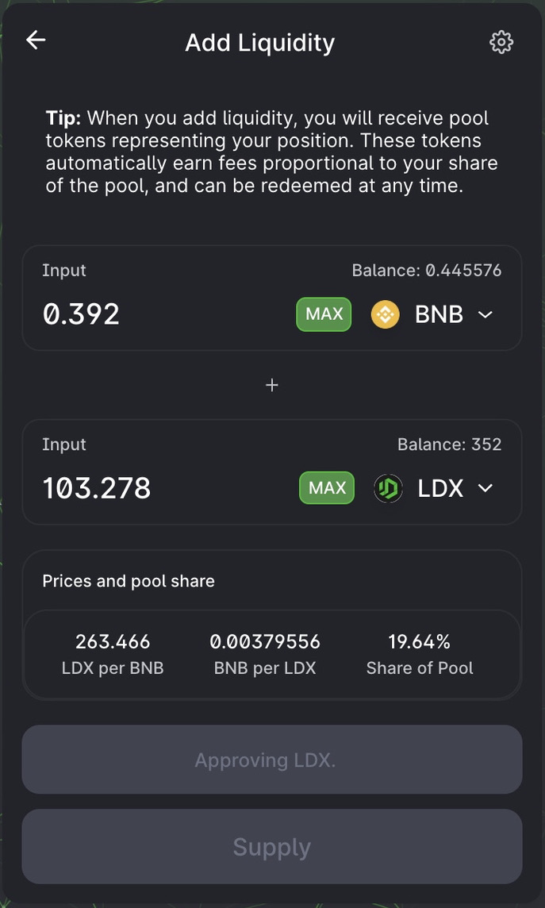

# Pengenalan Approval

Proses **Approval** adalah prosedur dalam transaksi, dimana protocol meminta persetujuan kepada pengguna, perihal penggunaan saldo Wallet. Prosedur berjalan ketika pengguna ingin bertransaksi melalui protocol LITEDEX. Dan prosedur ini, hanya berjalan saat pertama kali pengguna bertransaksi. Di LITEDEX sendiri, prosedur ini telah diterapkan disetiap fitur yang disediakan. Berikut tampilan Approval tersebut:‌

1. **Swap**

2. **Liquidity Pool**

3. **Staking**

4. **Yield Farming**

Semua prosedur Approval dilakukan melalui smart contract yang memiliki keamanan yang tinggi. Maka dari itu, Kami sangat menjamin keamanan dalam setiap transaksi.

