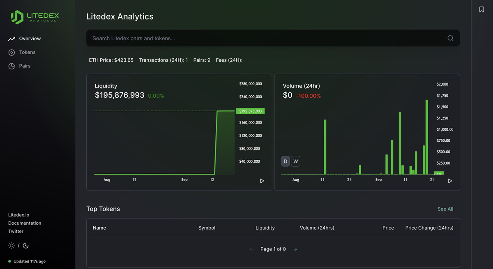

# Analitik \(Info\)

**Analitik** \(Analytic\) sebagai penyedia informasi berupa sekumpulan chart atau data-data yang tercatat dalam Blockchain. Data-data tersebut berisi Volume transaksi perhari, Total Liquidity, Top Token, Top Pair dan lain-lain. Ini informasi yang akurat dalam protocol terdesentralisasi. Karena langsung terintegrasi dengan Blockchain. Dan Anda bisa mengunjungi Analytic LITEDEX [disini](https://info.litedex.io/).

