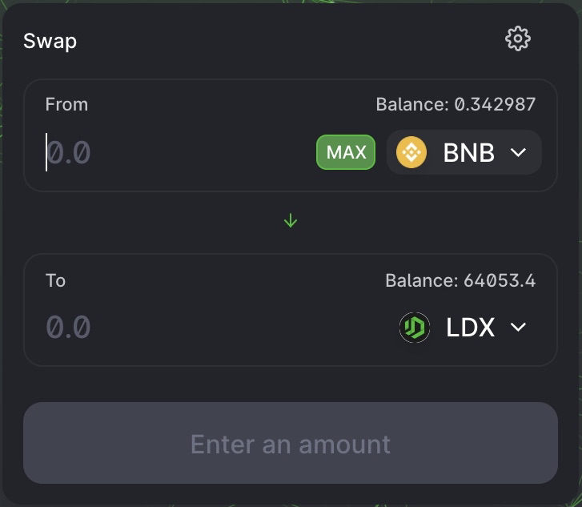
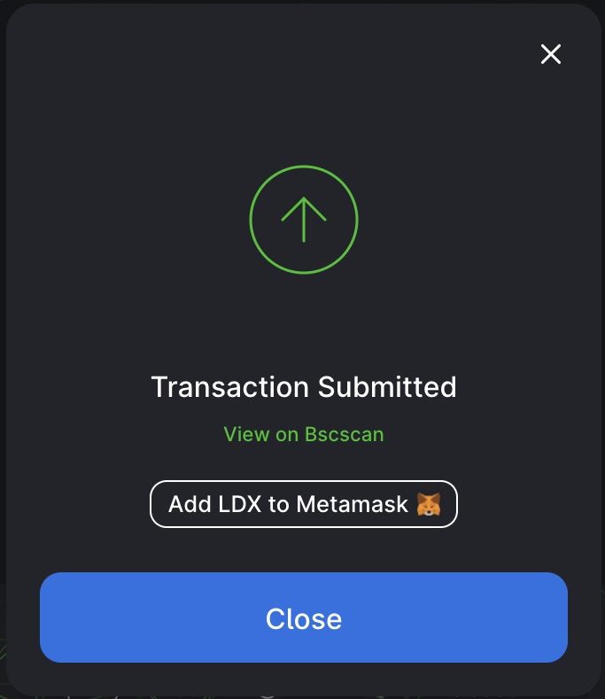

# Cara Berdagang

LITEDEX sangat berupaya memudahkan perdagangan untuk pengguna pemula dan pengguna berpengalaman. Maka dari itu Tim LITEDEX membuat tampilan yang sangat mudah dipahami dan mengajarkan langkah-langkah penggunaannya melalui dokumentasi LITEDEX.

### **Persiapan berdagang**

Sebelum Anda melakukan perdagangan, Anda harus memiliki Wallet. Jika belum memiliki, Anda bisa mempelajari dan sekaligus membuatnya [disini](../../memulai/cara-membuat-wallet.md)**.**  Dan jika Anda sudah memiliki Wallet, pastikan kembali Anda memiliki Token untuk melakukan perdagangan.

### **Berdagang di bursa LITEDEX**

1. Kunjungi halaman exchange [disini](https://swap.litedex.io/#/swap)

2. Setelah mengunjungi Website, Anda harus mengkoneksikan Wallet dengan platform LITEDEX. Klik “Connect to a wallet”.

3. Pilih Token yang ingin diperdagangkan dari menu dropdown atau ikon anak panah kebawah dibagian “From”. Dalam tutorial ini, pengaturan default Coin BNB. Karena kita melakukan Swap di Blockchain BSC, jika Anda menggunakan Blockchain ETH, pengaturan default ETH dan itu berubah tergantung Blockchain. Meski diatur secara default, Anda bisa menggantinya dengan Coin yang Anda inginkan, sebagai contoh Kami menggunakan Coin BNB untuk ditukar ke Coin LDX \(Bisa diganti dengan coin lain\). Sebelum melakukan Swap, pastikan Kembali saldo Anda cukup.

4. Masukkan nilai yang ingin diperdagangkan dibagian “From” dan secara otomatis akan ditampilkan konversi coin BNB-LDX.

Dan Anda bisa memperkirakan jumlah Coin yang ingin Anda tukar dengan melihat pada bagian “To” yang secara otomatis hasil dari konversi.

5. Setelah Anda sudah memasukkan jumlah sesuai yang Anda inginkan, mohon periksa kembali secara detail dan klik tombol tukar untuk memproses.

6. Dan sebuah jendela muncul dengan rincian lebih lanjut tentang transaksi tersebut. Periksa kembali apakah rinciannya benar.

Jika yakin benar, Anda bisa klik tombol “Swap Anyway”. Dan sistem memproses dengan Wallet meminta Anda untuk mengkonfirmasi tindakan tersebut.

7. 
Selesai! Anda dapat mengklik “View on BscScan” untuk melihat detail transaksi Anda di explorer. 

