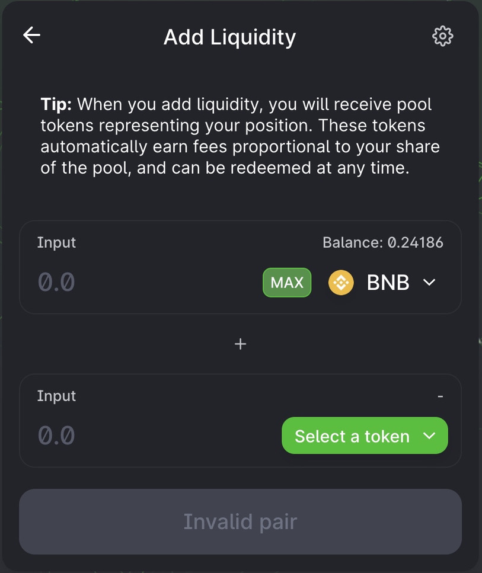
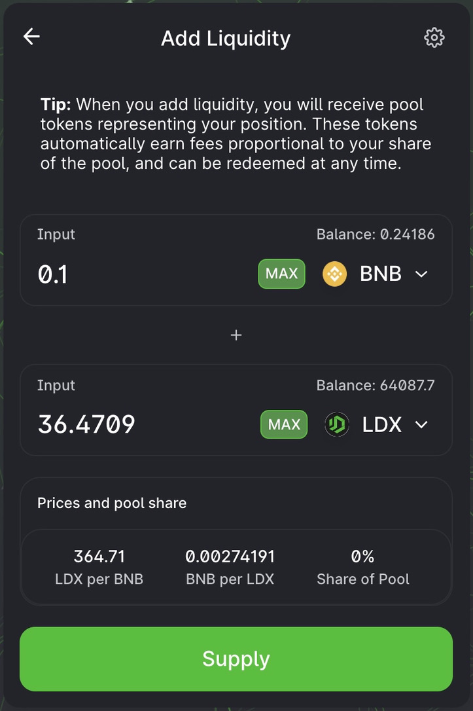
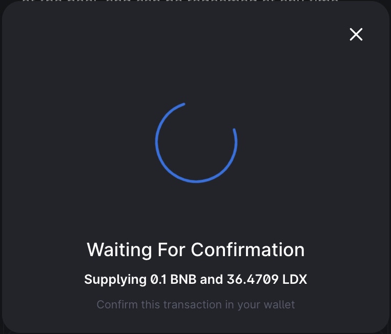
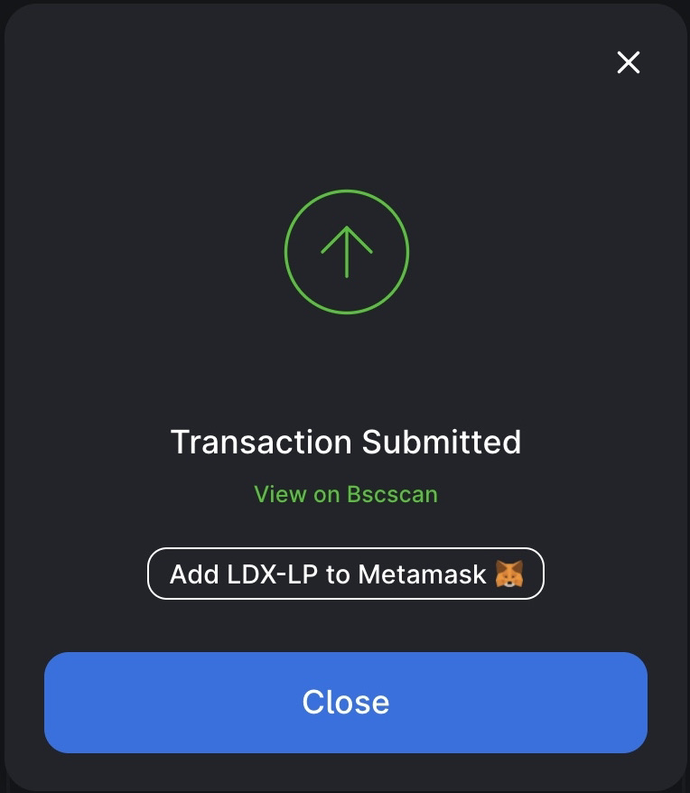
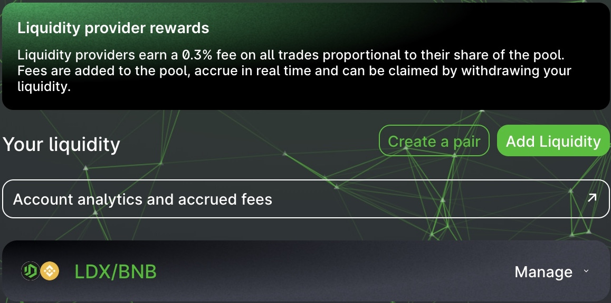
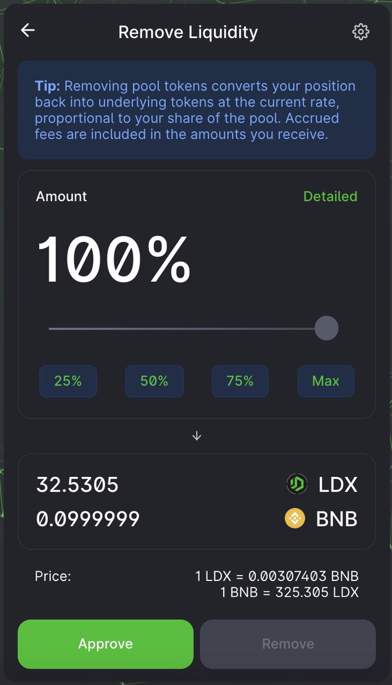
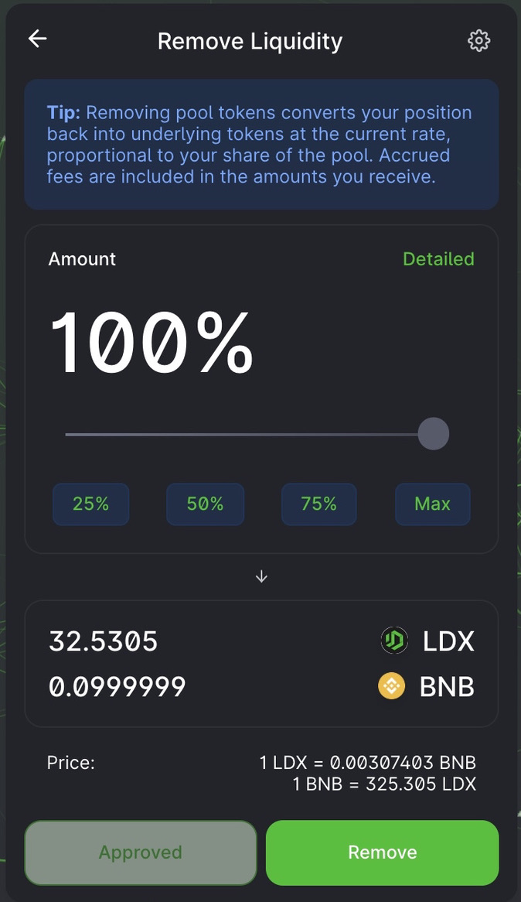
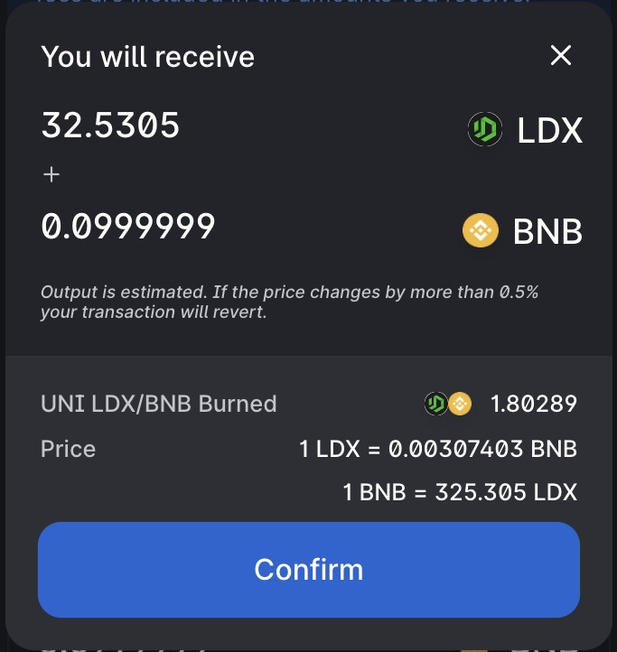
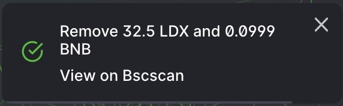

# Cara Menambah & Menghapus Liquidity

Di Likuiditas \(Liquidity\), Anda dapat menambahkan setiap pasangan token melalui halaman [likuiditas](https://swap.litedex.io/#/pool). Dan sebagai imbalannya Anda akan menerima biaya perdagangan untuk pasangan token yang telah ditambahkan, sekaligus menerima Token LP yang dapat Anda stake di Yield Farming untuk mendapatkan hadiah Token LDX.

### Cara menambahkan Liquidity 

Persiapan untuk menyediakan likuiditas adalah Pengguna harus menyediakan pasangan token yang dipilih dan memasukkan jumlah token sesuai keinginannya. Jika Anda membutuhkan berdagang untuk token yang dibutuhkan. Anda bisa mengunjungi panduan ini untuk mengetahui lebih [Cara berdagang](cara-berdagang.md).

Pada tutorial ini, Kami akan menambahkan likuiditas token BNB dan LDX.

1. Kunjungi halaman [Liquidity Pool](https://swap.litedex.io/#/pool). 

2. Klik tombol "Add Liquidity".

3. Pilih pasangan token yang sesuai keinginan Anda dengan cara klik "Select a token", disini kami akan menggunakan BNB dan LDX. 

4. Masukkan jumlah sesuai yang Anda inginkan pada bagian BNB \(atas\) atau bisa memasukkannya pada bagian LDX \(bawah\). Jika jumlah telah dimasukkan sesuai keinginan, Anda dapat klik "Supply" atau jika Anda belum pernah melakukan ini, Anda bisa pahami terlebih dahulu tentang [Approval](../../memulai/pengenalan-approval.md) karena ini bagian dari keamanan transaksi. 

5. Sebuah jendela muncul dengan rincian lebih lanjut tentang transaksi tersebut. Periksa kembali apakah rinciannya benar. Jika benar, Anda dapat klik "Confirm Supply". 

6. Tunggu sebentar prosesnya sampai Wallet Anda meminta mengkonfirmasi, klik "Confirm". 

7. Dan transaksi Anda bisa dicek dengan klik "View on Bscscan". 

8. Jika proses transaksi telah berhasil, Anda akan melihat saldo LP di halaman [ini](https://swap.litedex.io/#/pool).

**Simak video dibawah ini :**



### Cara menghapus Liquidity

1. Kunjungi halaman [Liquidity Pool](https://swap.litedex.io/#/pool).

2. Klik "Manage" pada pasangan token yang ingin Anda hapus.

3. Lalu klik "Remove".

4. Dan Anda dapat menyesuaikan jumlah yang ingin dihapus dalam LP tersebut. Disini Kami menghapus 100% dari pasangan token BNB-LDX.

5. Setelah itu Anda klik "Approve", jika Anda tidak mengetahui maksud dari Approve, Kami sediakan pembahasannya [disini](../../memulai/pengenalan-approval.md).

6. Wallet Anda meminta konfirmasi, klik "Confirm".

7. Jika proses konfirmasi telah selesai, Anda dapat klik "Remove" untuk melanjutkan.

8. Jendela baru muncul, meminta konfirmasi atas tindakan ini. Klik "Confirm".

9. Dan konfirmasi kembali Wallet Anda.

10. Pemberitahuan sukses muncul.

