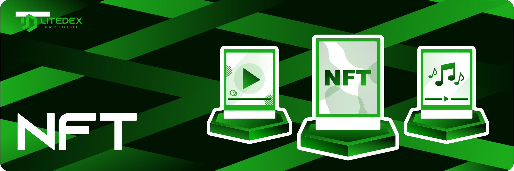

# Non-Fungible Tokan \(NFT\)

**Non-Fungible Token \(NFT\)** adalah asset crypto atau versi digitalisasi dari sebuah asset nyata di jaringan blockchain, memiliki kode identifikasi metadata yang unik dan token yang tidak dapat ditukarkan. Karena sifatnya yang unik, NFT tidak dapat diduplikasi. Dan dimanfaatkan oleh para seniman, musisi, dan developer properti.

**LITEDEX NFT Marketplace**

LITEDEX NFT Marketplace adalah pasar yang memperjual belikan bentuk digitalisasi dari koleksi seni dan real estat. LITEDEX NFT Marketplace pertama dibangun  di blockchain Binance Smart Chain dan secara bertahap dibangun pada blockchain populer yang telah diadopsi. 

**Art Collection NFT**

Art Collection NFT adalah karya seni digitalisasi yang telah menjadi Token non-fungible \(NFT\). Tujuan LITEDEX sendiri untuk menginspirasi para seniman membuat karya mereka sediri dan mengembangkan karya mereka di seluruh pasar NFT yang lebih luas. 

**Real Estate NFT**

Real Estate NFT adalah properti berupa tanah dan bangunan dalam bentuk digital/visual. Tujuan LITEDEX sendiri memperkenalkan kekuatan teknologi blockchain untuk berinovasi dalam industri real estat.

