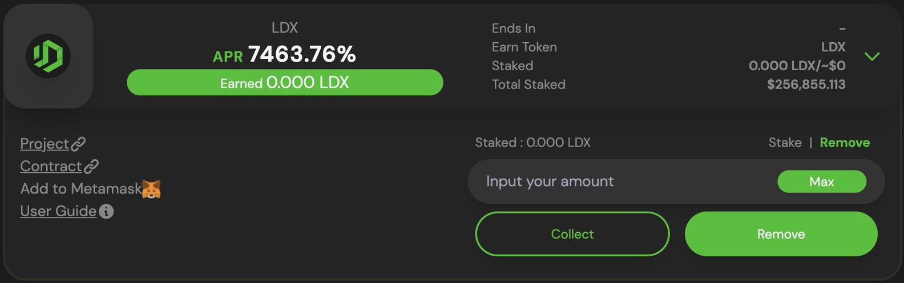
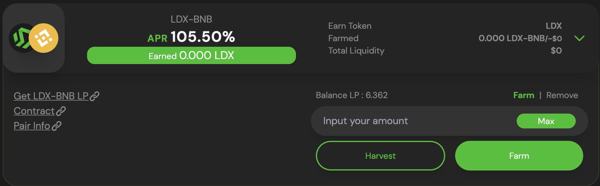
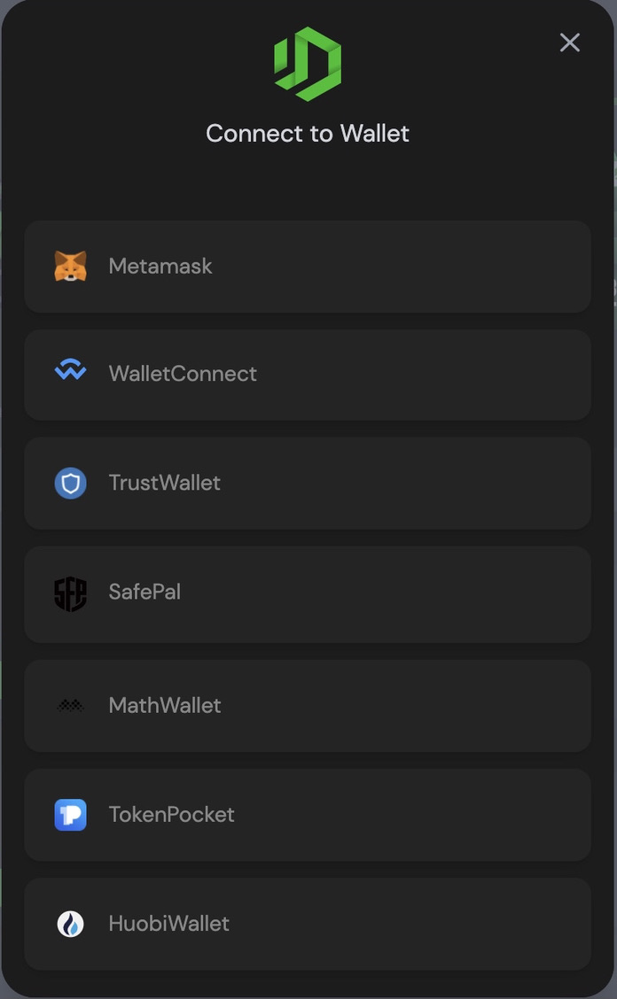
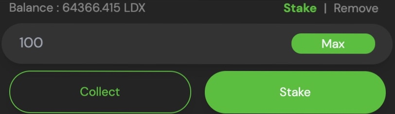
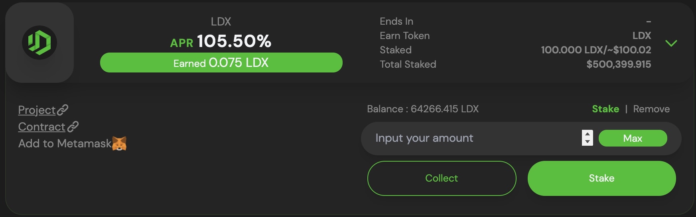
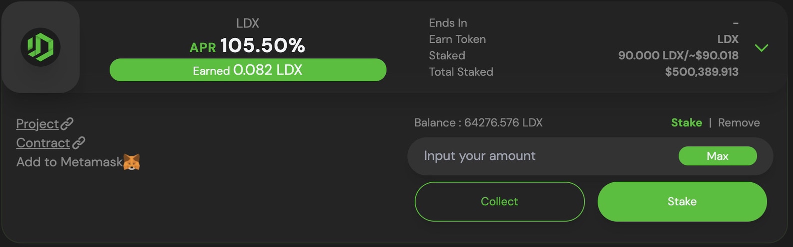
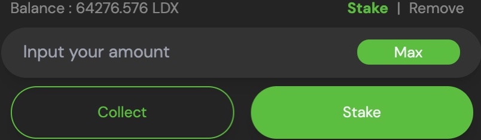
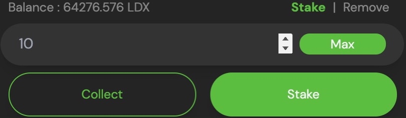
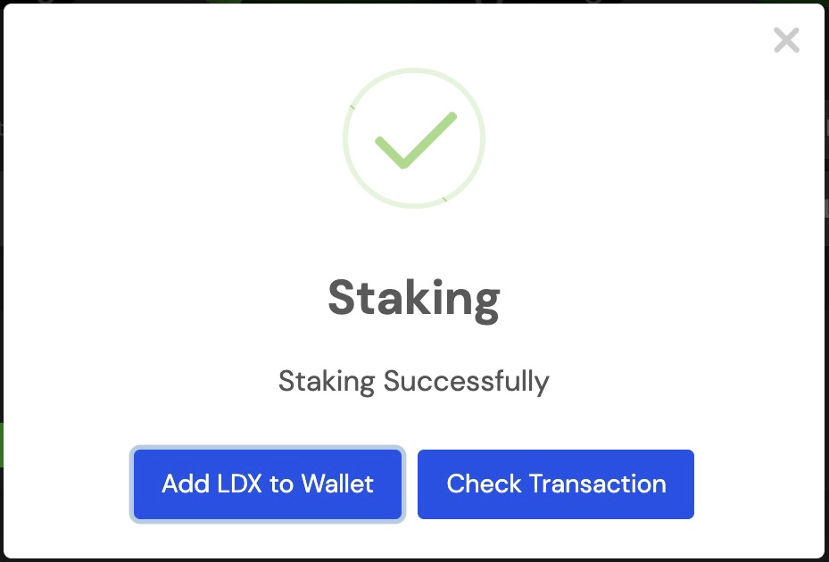
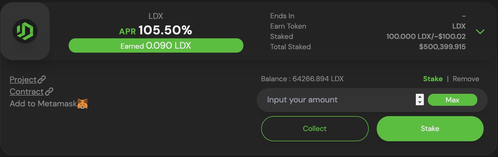

# Cara menggunakan Staking

Persiapan Staking, Anda hanya perlu satu token untuk memulai menghasilkan hadiah. Perbedaan yang paling sederhana dari Farming dan Staking adalah Farming perlu menyiapkan dua token untuk membuat Token LP, dan Staking hanya perlu satu token untuk bisa stake. Perbedaan keduanya terlihat pada interface LITEDEX, Farming memiliki dua token sedangkan Staking hanya memiliki satu token.‌

**Staking**

**Farming**

### **Memulai Staking** 

1. Kunjungi halaman [Staking](https://app.litedex.io/staking).‌

2. Hubungkan Wallet Anda dengan platform LITEDEX, klik “Connect Wallet” pada bagian atas sebelah kanan.‌

3. Pilih Wallet yang Anda gunakan, disini Kami menggunakan Metamask.‌

4. Wallet meminta konfirmasi untuk menghubungkan.‌

5. Jika Wallet telah terhubung, tombol Connect Wallet akan berganti menjadi tombol Address Anda, sebagai contoh tampilannya seperti ini.‌

6. Setelah Wallet Anda terhubung, pilih Token yang ingin Anda stake.‌

7. Disini Kami stake token LDX, pastikan Anda memiliki token yang ingin distake.‌

8. Masukkan jumlah yang Anda stake, disini Kami memasukkan **100** LDX lalu klik “Stake”.‌

9. Wallet meminta konfirmasi atas tindakan tersebut. Konfirmasikan terlebih dahulu di Wallet Anda, dan tunggu sebentar.‌

10. Berhasil!‌

**Simak video dibawah ini :**



### Menambah atau menghapus \(mengurangi\) Staking. 

Jika Anda ingin Menambahkan, menghapus \(mengurangi\) dan mengambil sebagian keuntungan dari Staking. Anda dapat melakukannya dengan mudah, karena Kami memberikan panduannya.‌

#### Menghapus \(mengurangi\) di Staking 

1. Pada halaman [Staking](https://app.litedex.io/staking), temukan tempat Staking Anda dan klik baris dimana saja untuk melihat lebih detail.‌

2. Pada bagian detail sebelah kanan, klik “Remove” .‌

3. Disini Kami memiliki Balance Staked **100** dan ingin mengurangi **10**. Masukkan jumlah yang ingin Anda hapus \(kurangi\), lalu klik “Remove”.‌

4. Wallet Anda meminta konfirmasi atas tindakan tersebut. Konfirmasikan terlebih dahulu, dan tunggu sebentar.‌

5. Anda telah berhasil menghapus \(mengurangi\) Staking. Proses ini secara otomatis mengambil hadiah yang distake.‌

**Simak video dibawah ini :**



#### Menambah Staking 

1. Kunjungi halaman [Staking](https://app.litedex.io/staking).‌

2. Temukan Staking Anda, dan klik baris dimana saja untuk menampilkan detailnya.‌

3. Pada bagian detail sebelah kanan, pastikan tulisan “Stake” berwarna hijau yang berarti kondisinya sedang aktif, begitu sebaliknya jika tulisan “Remove” berwarna hijau.‌

4. Masukkan jumlah yang Anda tambahkan, disini Kami ingin menambahkan **10** LDX. Lalu klik tombol “Stake”.‌

5. Wallet Anda meminta konfirmasi atas tindakan tersebut. Konfirmasikan terlebih dahulu, dan tunggu sebentar.‌

6. Berhasil! Anda telah menambahkan Stake.‌

**Simak video dibawah ini :**



**Mengambil keuntungan Staking**‌

1. Kunjungi halaman [Staking](https://litedex-app.vercel.app/staking).‌

2. Temukan Staking Anda, dan klik baris dimana saja untuk menampilkan detailnya.‌

3. Pada bagian detail sebelah kanan, klik “Collect” untuk mengumpulkan semua hadiah Staking.‌

4. Wallet meminta konfirmasi transaksi tersebut. Tunggu sebentar, sampai proses selesai.‌

5. Pengumpulan hadiah berhasil! Anda dapat cek balance Wallet yang dimiliki.

**Simak video dibawah ini :**



