# Cara menggunakan Yield Farming

### Persiapan

Yield Farming mengharuskan pengguna menyediakan pasangan token untuk mendapatkan Token LP. Token LP dapat ditransaksikan di Farming untuk menghasilkan hadiah token LDX. Dan untuk mendapatkan Token LP, Anda bisa menambahkannya di Liquidity Pool. Jika Anda belum mengetahui cara menambahkan Token LP, Anda bisa pahami panduan [ini](../exchange/cara-menambah-and-menghapus-liquidity.md).

### Pilih Farming

Kunjungi halaman [Farming](https://app.litedex.io/farming) dan pilih pasangan token yang Anda inginkan.

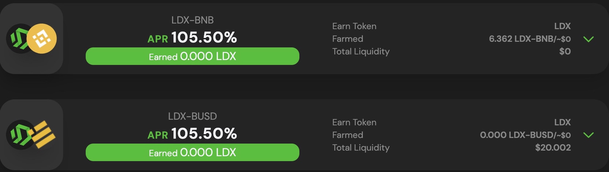

### Menyediakan likuiditas

Setelah Anda menemukan Token LP untuk difarming, Anda perlu menambahkan likuiditas untuk mendapatkan Token LP yang diinginkan.

1. Setelah Anda mengunjungi Website [Farming](https://app.litedex.io/farming), hubungkan Wallet Anda dengan platform LITEDEX, klik "Connect Wallet" pada bagian atas sebelah kanan.

2. Pilih Wallet yang Anda gunakan, disini kami menggunakan Metamask.

Lalu konfirmasikan Wallet Anda untuk menguhubungkan ke platform LITEDEX.

3. Jika Wallet telah terhubung, tombol Connect Wallet akan berganti menjadi tombol Address Anda, sebagai contoh tampilannya seperti ini. 

4. Setelah Wallet terhubung, Anda dapat klik baris Farming untuk menampilkan lebih detail. Sebagai contoh, disini Kami akan memilih pasangan token LDX-BNB.

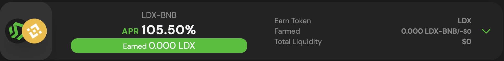

5. Pada tampilan yang lebih detail, dibagian kiri Anda akan melihat beberapa tautan. Klik “Get LDX-BNB LP”.

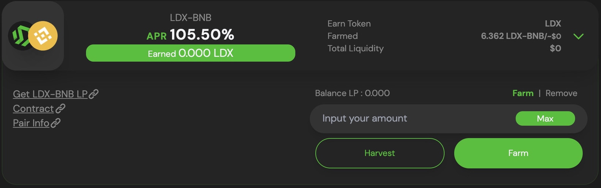

6. Dan halaman Add Liquidity akan membuka halaman baru untuk pasangan token yang Anda pilih. 

**Simak video dibawah ini :**



Jika Anda tidak mengetahui cara menambahkan liquidity, Anda dapat mengikuti panduan [**Cara Menambah/Menghapus liquidity**](../exchange/cara-menambah-and-menghapus-liquidity.md) dan sesuaikan dengan pasangan token yang Anda pilih.

### Menempatkan Token LP ke Farm

Pada tutorial sebelumnya, Kami anggap Anda telah Menambahkan Liquidity atau telah memiliki pasangan Token LP.

1. Pada halaman [Farming](https://app.litedex.io/farming), Anda bisa menempatkan Token LP sesuai pada baris Token LP yang dimiliki. Disini sebelumnya Kami telah memiliki Token LP LDX-BNB. Klik dimana saja pada baris yang menunjukan pasangan token Anda.

2. Masukkan jumlah Token LP pada bagian detail sebelah kanan. 

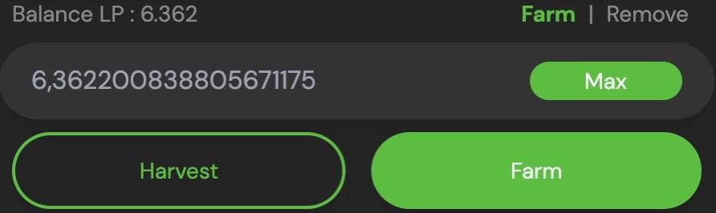

Jika Anda telah memasukkan jumlahnya, Anda dapat klik “Farm” untuk mengeksekusi.

3. Dan Wallet Anda meminta konfirmasi atas transaksi tersebut. Tunggu sebentar.

4. Selesai! Anda telah berhasil Farming.

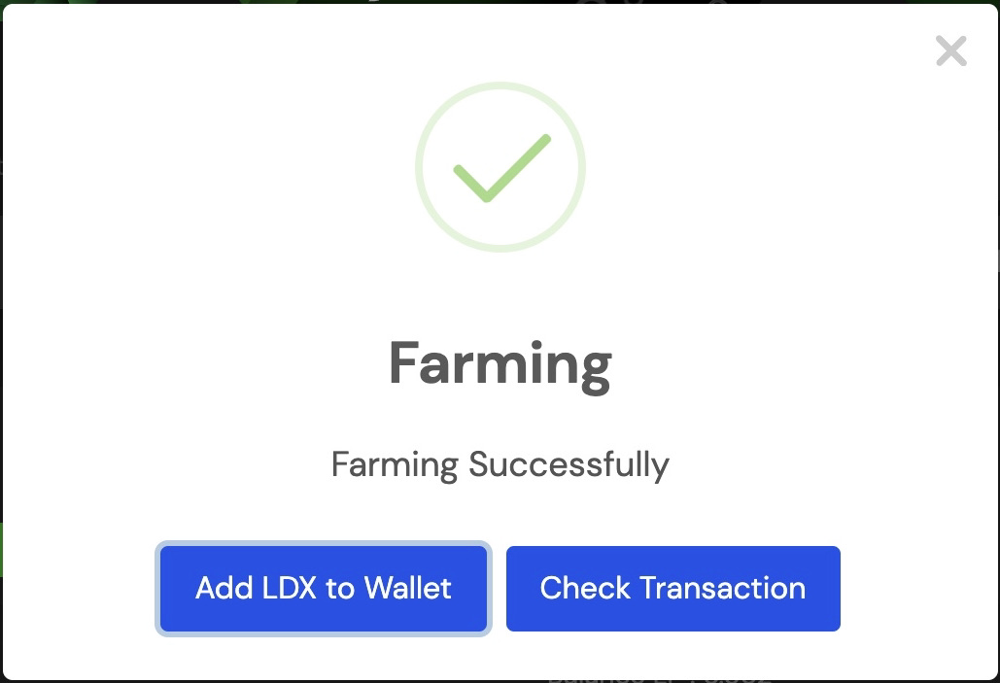

### **Menambah atau menghapus \(mengurangi\) Token LP dari Farming**

Jika Anda ingin menambah, menghapus \(mengurangi\) dan mengambil sebagian keuntungan dari Farming. Anda dapat melakukannya dengan mudah.

#### **Menghapus \(mengurangi\) Token LP**

1. ****Pada halaman [Farming](https://app.litedex.io/farming), cari Farming tempat Anda memiliki Token LP, dan klik baris dimana saja untuk melihat lebih detail. 

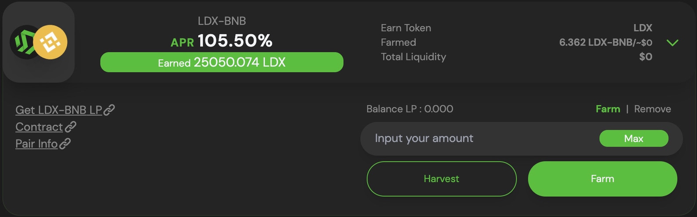

2. Pada bagian detail sebelah kanan, klik “Remove”.

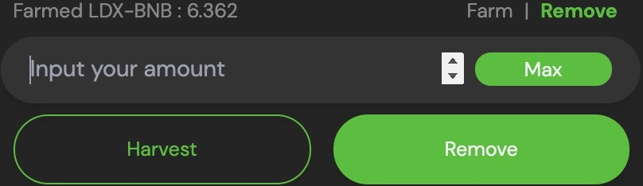

3. Disini Kami memiliki Balance LP **6.362** dan ingin mengurangi **1**. Masukkan jumlah yang ingin Anda hapus \(kurangi\), lalu klik “Remove”.

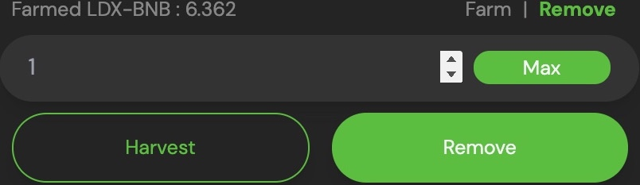

4. Wallet Anda meminta konfirmasi atas transaksi tersebut. Tunggu sebentar, sampai balance LP Anda berkurang sesuai yang Anda inginkan. Disini Balance Kami yang awalnya **6.362** dan dikurangi **1**, setelah transaksi telah selesai. Balance LP Kami menjadi **5.362** yang berarti transaksi berhasil. Jika Anda telah melepaskan Token LP yang dimiliki, semua hadiah yang belum diharvest akan secara otomatis dikumpulkan.

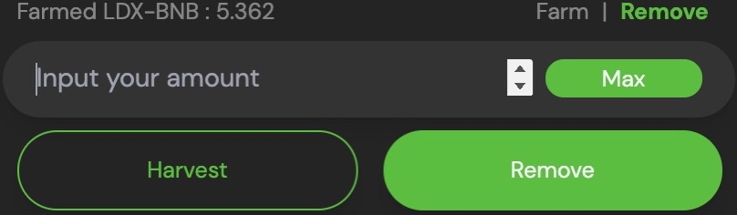

#### **Menambahkan Token LP**

1. ****Pada halaman [Farming](https://app.litedex.io/farming), cari  Farming tempat Anda memiliki Token LP, dan klik baris dimana saja untuk melihat lebih detail.

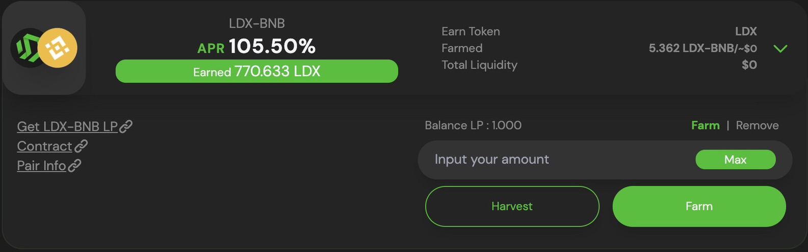

2. ****Pada bagian detail sebelah kanan, pastikan tulisan “Farm” berwarna hijau yang berarti kondisinya sedang aktif, begitu sebaliknya jika tulisan “Remove” berwarna hijau.

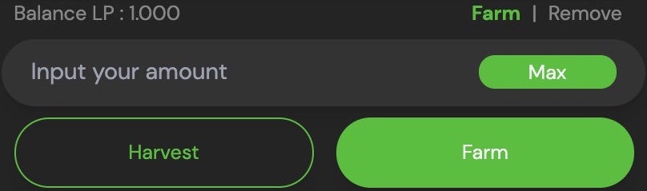

3. Masukkan jumlah yang Anda inginkan, disini Kami ingin menambahkan **1** Balance LP. Lalu klik “Farm”.

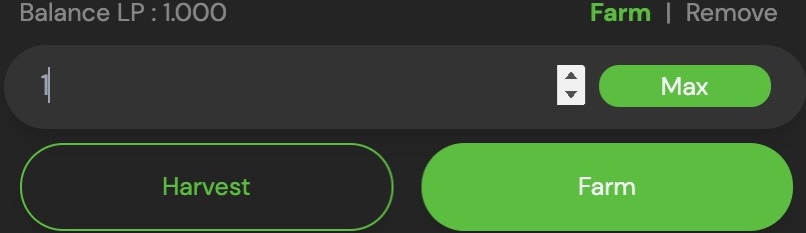

4. Dan Wallet meminta konfirmasi Anda, tunggu sebentar.

5. Transaksi berhasil!

#### **Mengambil keuntungan**

1. ****Kunjungi halaman [Farming](https://app.litedex.io/farming).

2. ****Temukan Farming Anda, dan klik baris dimana saja untuk menampilkan detailnya.

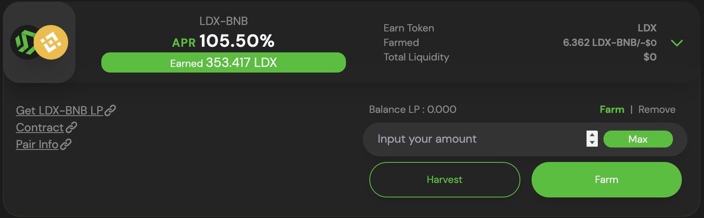

3. Pada bagian detail sebelah kanan klik “Harvest” untuk mengumpulkan semua hadiah Farming.

4. Wallet meminta konfirmasi transaksi tersebut. Tunggu sebentar, sampai proses selesai.

5. Pengumpulan hadiah berhasil! Anda bisa cek saldo Wallet yang dimiliki.

