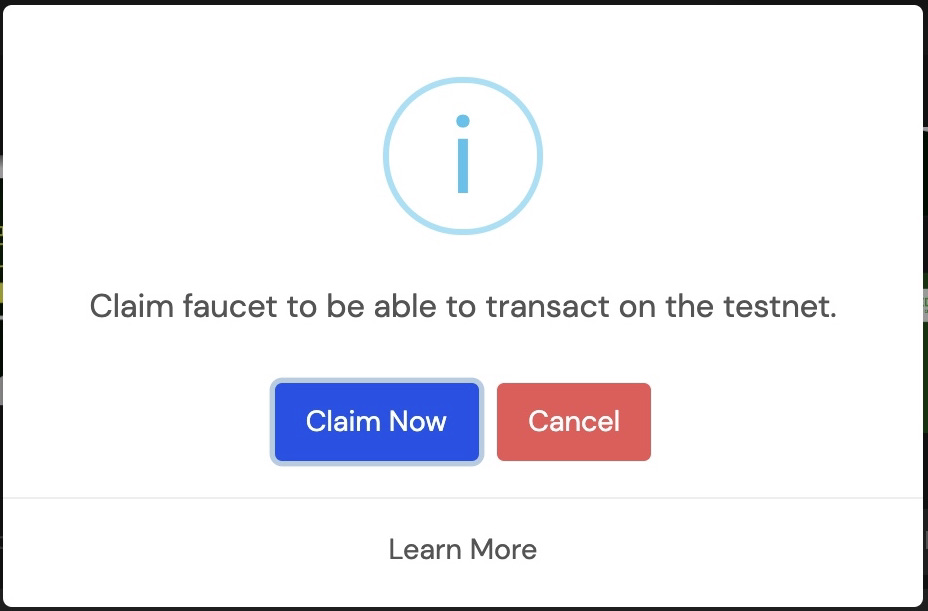

# Cara Klaim Faucet

### **Klaim Faucet ETH \(Rinkeby\)**

#### **Persiapan** 

Sebelum melakukan klaim faucet, Anda harus menginstall wallet metamask dan pastikan jaringan berada di ETH testnet \(rinkeby\) dan memiliki akun twitter.

#### **Memulai klaim faucet ETH**

1. Kunjungi halaman [app.litedex.io](http://app.litedex.io)

2. Klik tombol “Claim Faucet”

3. Website menampilkan pop up dan klik “Claim Now”

4. Tab baru muncul dan menampilkan halaman faucet rinkeby.

5. Copy address Wallet Anda dan pastekan pada twit akun twitter.

6. Copy URL twit tersebut dan pastekan pada input halaman website faucet rinkeby, 

klik tombol “Give me Ether”, pilih jumlah ether sesuai yang Anda inginkan.

7. Selesai dan cek saldo di metamask Anda

### **Klaim Faucet BSC**

#### **Persiapan**

Sebelum melakukan klaim faucet, Anda harus menginstall wallet metamask dan pastikan jaringan berada di BSC.

#### **Memulai klaim faucet BSC**

1. Kunjungi halaman [app.litedex.io](http://app.litedex.io)

2. Klik tombol “Claim Faucet”.

3. Website menampilkan pop up dan klik “Claim Now”

4. Tab baru muncul menampilkan input faucet.

5. Copy address Wallet Anda, paste kan pada input faucet dan klik tombol “Give me BNB”.

6. Tunggu proses pengiriman coin BNB ke address Anda.

7. Selesai, cek saldo wallet anda.

