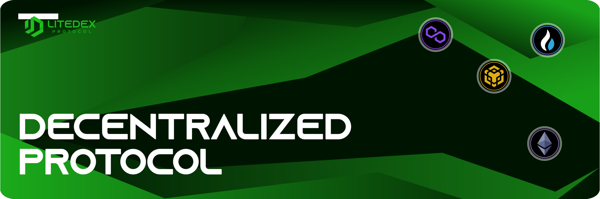

# Exchange

A **decentralized exchange** is a cryptocurrency exchange that utilize smart contract to allow investors to trade between users automatically. Decentralized exchange do not use any third party, centralized authority and do not require personal data to process the transactions. An addition to it, there will be no risk of server downtime as the platform hosting is distributed through nodes and the decentralized exchange system protected from being hack because it is being use in most of the computers in the world.‌

**LITEDEX** is a decentralized protocol that use an Automated Market Maker \(AMM\) of the Constant Product Market Maker \(CPMM\) type which is represented by classic functions:‌

**x\*y=c**‌

Where **x** and **y** are defined as reserves of certain assets in the pool and **c** is a constant that cannot be changed. This serves to set the price of the selected token, which means that if the supply of **x** tokens increases, then the supply of **y** tokens decreases to maintain a constant value of **c**. This type of AMM, will always be able to provide liquidity, no matter how large the order sizes or how small the liquidity pool.‌

**Swaps/Trading**‌

Swap allows users to trade or exchange coins in a decentralized manner. All transactions are made through your own Wallet, without any third party owning your coins.‌

**Liquidity Pool**‌

Decentralized exchange only operate if there is sufficient liquidity to support trading, otherwise there is no LP at your disposal. You can provide liquidity with the tokens you placed into the Pool. As a liquidity provider, you will be rewarded in the form of trading fees to ensure there is always liquidity used by the exchange.‌

And some other features that will be discussed by points

