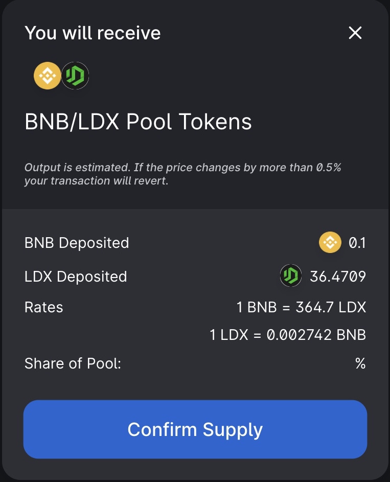

# How to Add & Remove Liquidity

In Liquidity, you can add each token pair via the [liquidity ](https://swap.litedex.io/#/swap)page. In return, you will receive trading fees for the token pairs that have been added and receive LP Tokens which you can stake in Yield Farming to earn LDX Token rewards.

### **How to Add Liquidity**

User must provide the selected token pair and enter the number of tokens as desired during the preparation for providing liquidity. If you need to trade for required tokens and You can visit this guide to find out more [How to trade](how-to-trade.md).

In this tutorial, we will add liquidity to BNB and LDX tokens.

1. Visit the[ Liquidity Pool](https://swap.litedex.io/#/pool) page.

2. Click the "Add Liquidity" button.

3. Select the token pair that suits you by clicking "Select a token", here we will use BNB and LDX.

4. Enter the amount needed in the BNB section \(top\) or you can enter it in the LDX section \(bottom\). If the amount has been entered as desired, you can click "Supply" or if you have never done this, you can understand first about [Approval ](../../get-started/approval-introduction.md)because this is part of transaction security.

5. The screen will appear with more details about the transaction. Double check that the details are correct. If correct, you can click "Confirm Supply".

6. Wait for the process until your Wallet asks to confirm, click "Confirm".

7. And your transaction can be checked by clicking "View on Bscscan".

8. If the transaction process has been successful, you will see your LP balance on this page.

### **How to Remove Liquidity**

1. Visit the [Liquidity Pool](https://swap.litedex.io/#/pool) page.

2. Click "Manage" on the token pair you want to delete.

3. Then click "Remove".

4. You can adjust the amount you want to delete in the LP. In this stage, 100% of the BNB-LDX token pair will be remove.

5. Click "Approve" once done. If you are unsure in the Approve stage, we will provide [here](../../get-started/approval-introduction.md).

6. Your wallet asks for confirmation, click "Confirm".

7. When the confirmation process is complete, you can click "Remove" to continue.

8. A new screen will appear asking for confirmation of this action. Click "Confirm".

9. And reconfirm your Wallet.

10. A success notification appears.

