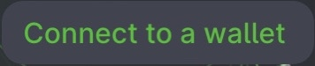
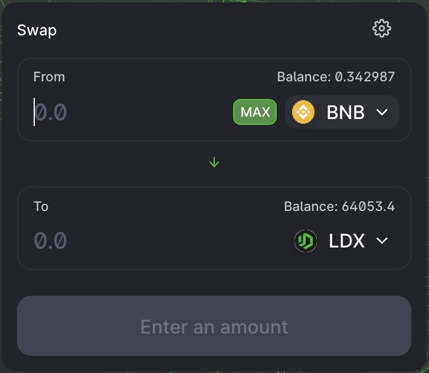
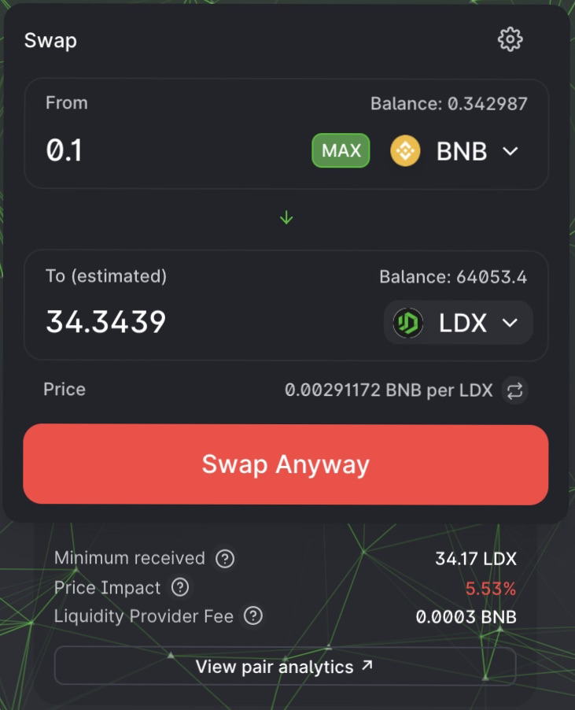
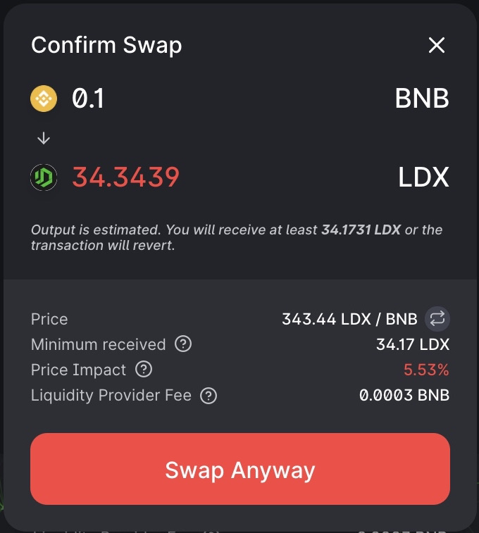
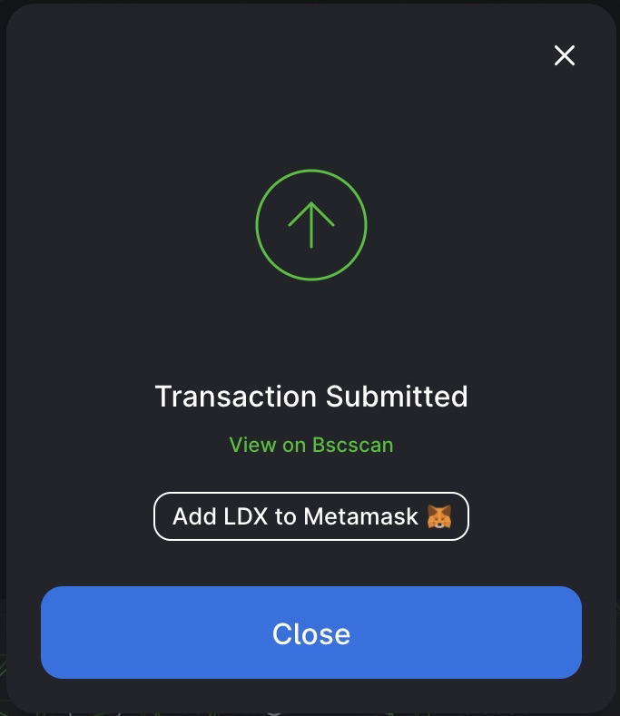

# How to Trade

LITEDEX puts a lot of effort into making trading easy for both novice and experienced users. LITEDEX Team had created an easy to understand interface and teaching the steps on how to use it through the LITEDEX documentation.

**Trading preparation**

Before you make a trade, you must have a Wallet. If you don't have it, you can learn and make it [here ](../../get-started/how-to-make-a-wallet.md)at the same time. And if you already have a Wallet, make sure you again have Tokens to trade.

**Trade on the LITEDEX exchange**

1. Visit the exchange page [here](https://swap.litedex.io/#/swap)

2. After visiting the Website, you must connect the Wallet to the LITEDEX platform. Click “Connect to a wallet”.

3. Select the Token you want to trade from the drop down menu or the down arrow icon in the “From” section. In this tutorial, BSC Coin default settings. Since we are swapping on the BSC Blockchain, if you are using the ETH Blockchain, the default setting is ETH and it changes depending on Blockchain. Even though it is set by default, you can replace it with any Coin you want, for example We use BNB Coin to exchange to LDX Coin \(Can be replaced with other coins\). Before swapping, make sure your balance is sufficient.

4. Enter the value you want to trade in the “From” section and the BNB-LDX coin conversion will automatically be displayed.

And you can estimate the number of Coins you want to exchange by looking at the “To” section which automatically results from the conversion.

5. After you have entered the amount you need, please double check the details and click the exchange button to process.

6. And a screen will appear prompting with more details about the transaction. Double check that the details are correct.

Once confirm, you can click the "Swap Anyway" button. And the system process with Wallet asking you to confirm the action.

7. Done! You can click “View on BscScan” to view your transaction details in explorer.

**Watch the video below :**



