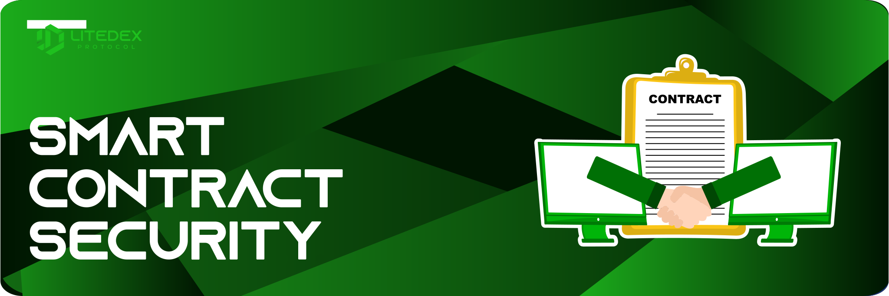

# Security & Audits

As a platform, LITEDEX highly prioritize security for the users. We ensure in conducting regular checks on smart contract in order to continuously improve the best security standards. The best blockchain security audit company had been commissioned for our auditing. The following is our audit evidence or process:‌

* ​[Certik](https://www.certik.org/) - Onboarding ⏳
* ​[Haechi Audit](https://audit.haechi.io/) - Onboarding⏳

###  **Smart Contract Security** 

**Smart contract** is an agreement between two parties in the form of computer code that runs on a blockchain network. The agreement will be stored in a public database and cannot be changed. The transactions are processed by the blockchain where the smart contract can be sent automatically without having any third party involve such as \(banks, governments, brokers, etc.\). Transactions will only occur if the terms of the agreement are met. Without a third party, there is no entity could execute the smart contract. With such safety features, the LITEDEX Team will keep conducting routine auditing and layered security checks.

